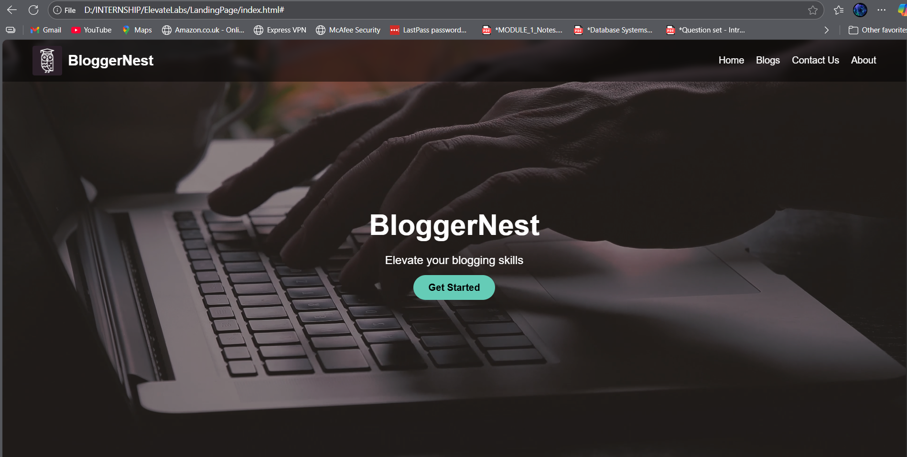
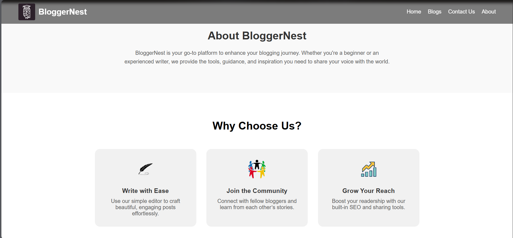
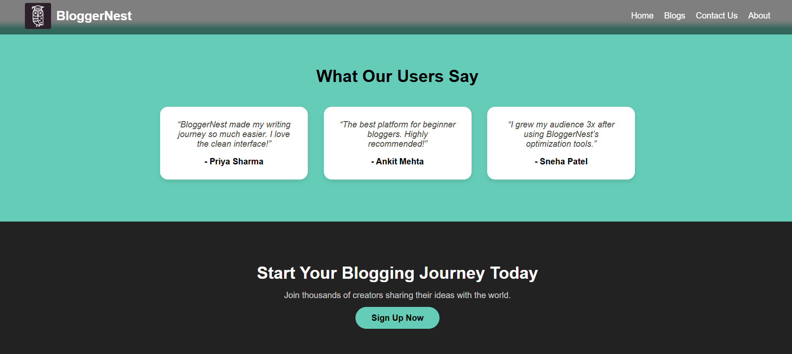
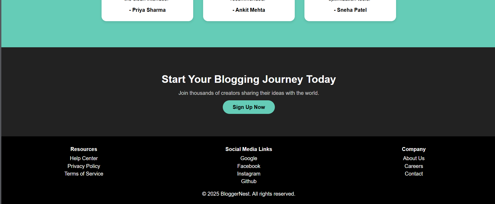

🪶 BloggerNest – Responsive Landing Page

🧠 Internship Task 1 – Elevate Labs
Objective:
Create a simple, responsive landing page using HTML & CSS that includes a header, hero section with video, content sections, and footer.

🧩 Features

✅ Responsive design (works on all screen sizes)
✅ Background video in the hero section
✅ Clean and modern layout using Flexbox & Grid
✅ Interactive navigation bar
✅ About, Features, Testimonials, and Call-to-Action sections
✅ Footer with useful links and social media handles

🛠️ Tools & Technologies Used

✅ HTML5
✅ CSS3 (Flexbox, Grid, Media Queries)
✅ VS Code (for coding)
✅ Live Server Extension (for real-time preview)
✅ Google Chrome (for testing responsiveness)

---

## 📸 Screenshots

### 🏠 Hero Section

### 💡 About Section

### ⭐ Features Section

### 💬 Testimonials Section

### 📞 Call-to-Action & Footer

---